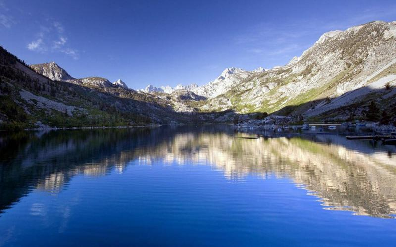
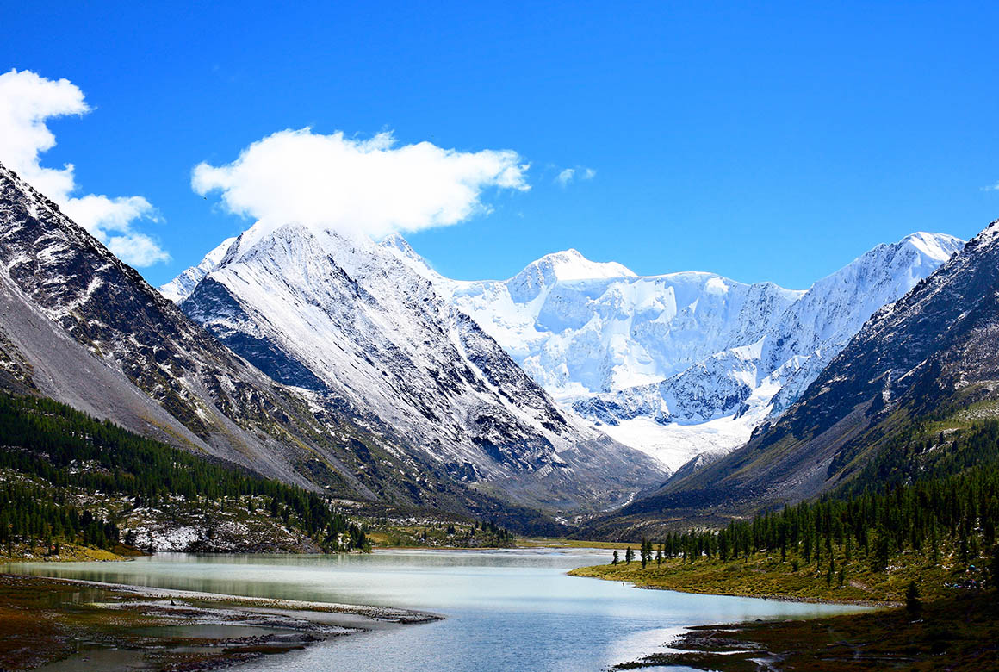
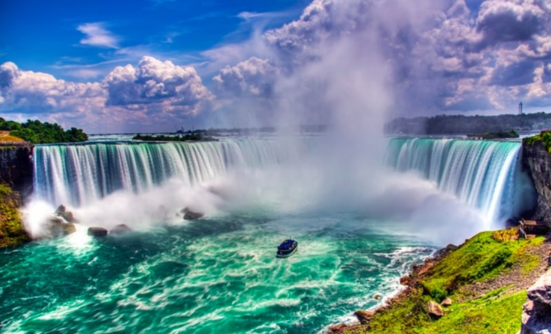
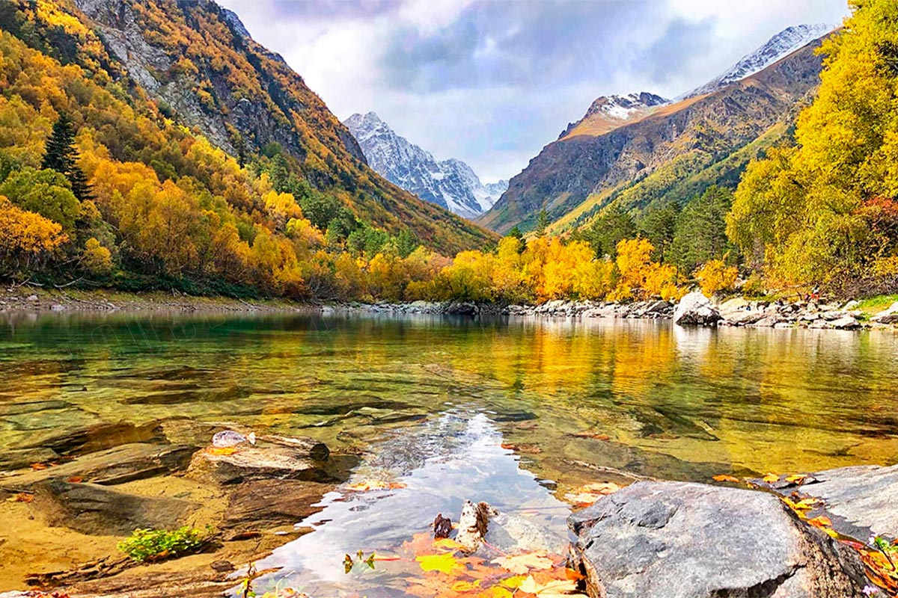
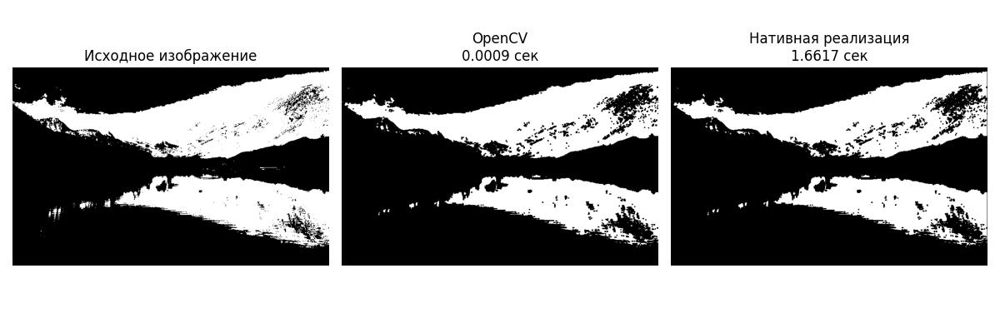
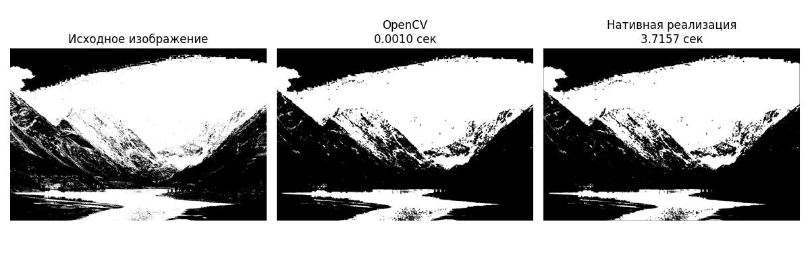
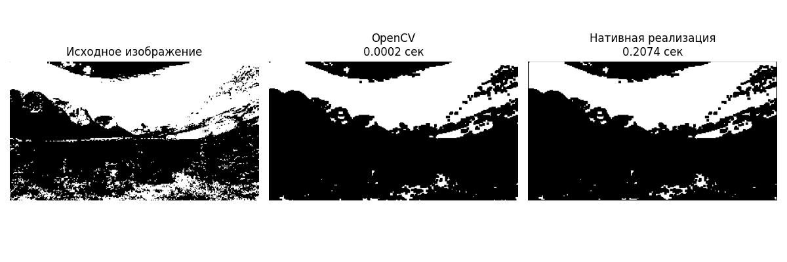
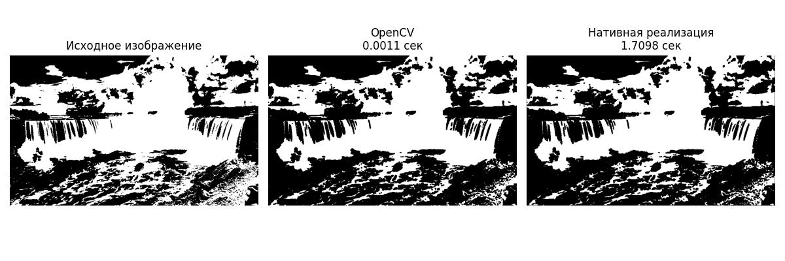
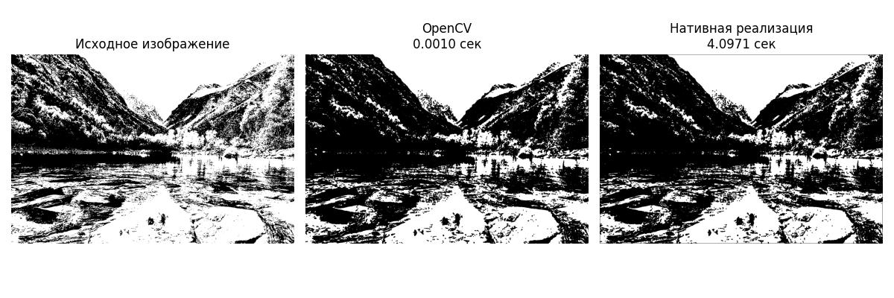
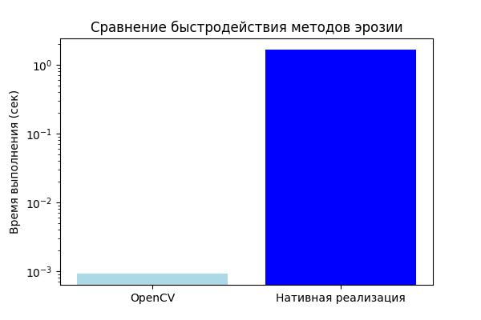

# Реализация алгоритма эрозии изображения

## 1. Теоретическая база

Эрозия - это один из основных морфологических операторов в обработке изображений. Эта операция "съедает" или "уменьшает" границы объектов на бинарном изображении. 

Принцип работы:
- Для каждого пикселя изображения рассматривается окрестность размером 3x3 пикселя
- Если хотя бы один пиксель в окрестности равен 0, центральный пиксель становится равным 0
- В результате объекты на изображении уменьшаются, а мелкие детали могут исчезнуть

Математически эрозию можно описать как:
```
(I ⊖ K)(x,y) = min{I(x+i,y+j) | (i,j) ∈ K}
```
где I - исходное изображение, K - структурный элемент (ядро).

## 2. Описание разработанной системы

В проекте реализованы два подхода к выполнению эрозии:

1. Использование встроенной функции OpenCV (`cv2.erode`)
2. Нативная реализация на Python с использованием NumPy

### Алгоритм нативной реализации:
1. Создание выходного изображения того же размера
2. Для каждого пикселя (кроме границ):
   - Выделение окна 3x3 вокруг текущего пикселя
   - Нахождение минимального значения в окне
   - Присвоение минимального значения центральному пикселю выходного изображения

## 3. Результаты работы и тестирования

Для тестирования системы используются бинарные изображения. Программа:
1. Загружает изображение
2. Конвертирует его в бинарное представление
3. Применяет оба метода эрозии
4. Измеряет время выполнения
5. Визуализирует результаты

### Итоговая таблица результатов:

| Изображение | OpenCV время (с) | Нативная реализация (с) | Разница в скорости |
|-------------|-------------------|--------------------------|--------------------|
| 1           | 0.000918          | 1.661735                 | 1810.343636        |
| 2           | 0.000990          | 3.715682                 | 3754.444230        |
| 3           | 0.000176          | 0.207437                 | 1178.934959        |
| 4           | 0.001066          | 1.709826                 | 1603.292868        |
| 5           | 0.000985          | 4.097108                 | 4159.893004        |

### Исходные изображения:

1.   
2.   
3.   
4.   
5.   

### Результаты обработки:

1.   
2.   
3.   
4.   
5.   

### Графики со сравнением:

1.   
2.   
3.   
4.   
5.   

## 4. Выводы

1. OpenCV реализация работает значительно быстрее из-за оптимизации на уровне C++
2. Нативная реализация более наглядно демонстрирует принцип работы алгоритма
3. Результаты обработки обоими методами идентичны

## 5. Использованные источники

1. OpenCV Documentation - [Morphological Operations](https://docs.opencv.org/master/d9/d61/tutorial_py_morphological_ops.html)
2. Digital Image Processing (4th Edition) by Rafael C. Gonzalez and Richard E. Woods
3. NumPy Documentation - [Array Operations](https://numpy.org/doc/stable/reference/arrays.html)
