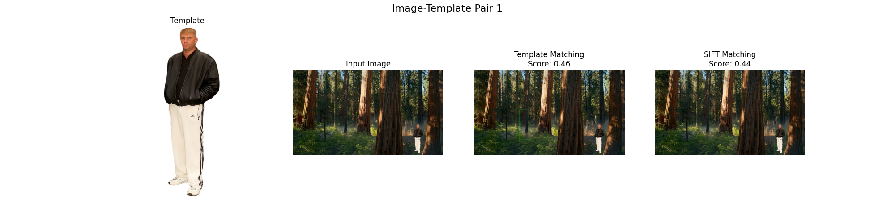
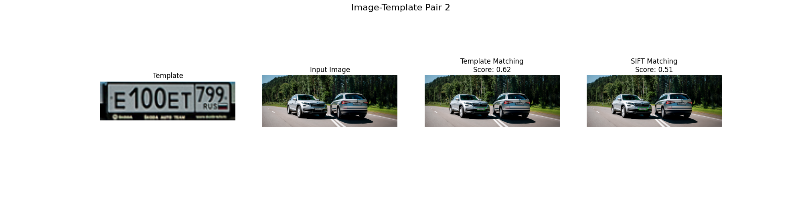
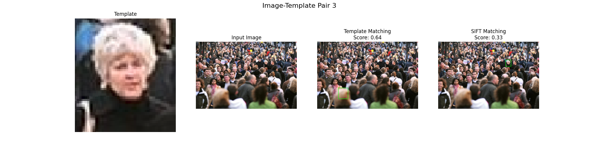
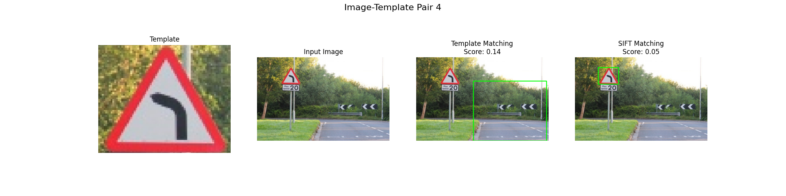
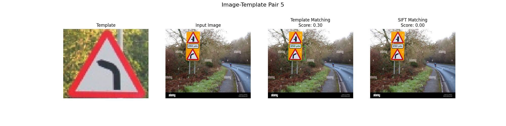
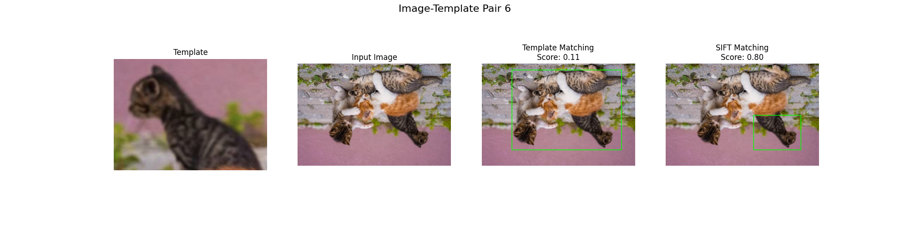
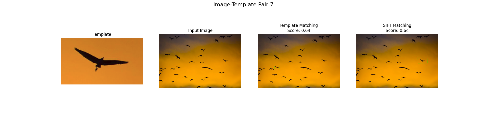
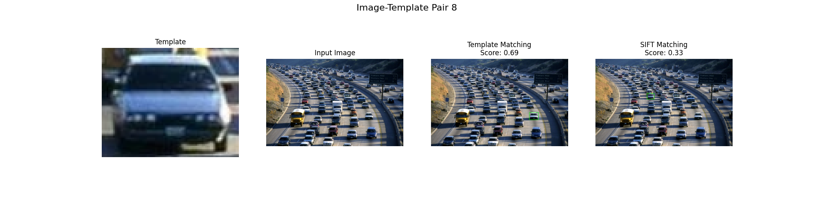
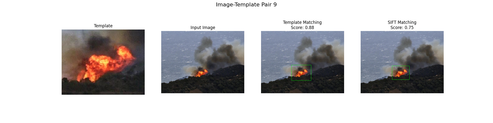
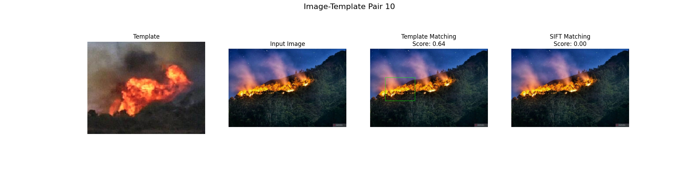

# Сравнение алгоритмов поиска объектов на изображении

## 1. Теоретическая база

### Template Matching
Template Matching - это метод поиска области изображения, которая соответствует шаблону. Алгоритм работает путем перемещения шаблона по изображению и вычисления меры схожести для каждой позиции. В данной реализации используется метод нормализованной кросс-корреляции (TM_CCOEFF_NORMED).

### SIFT (Scale-Invariant Feature Transform)
SIFT - это алгоритм компьютерного зрения для обнаружения и описания локальных признаков изображения. Основные этапы:
1. Обнаружение ключевых точек
2. Вычисление дескрипторов
3. Сопоставление точек между изображениями
4. Фильтрация совпадений и определение положения объекта

## 2. Описание разработанной системы

Система реализована на Python с использованием OpenCV. Основные компоненты:

### Класс ImageMatcher
- `template_matching()`: реализация поиска методом Template Matching
- `sift_matching()`: реализация поиска с помощью SIFT
- `draw_matches()`: визуализация результатов

### Особенности реализации:
1. Template Matching:
   - Конвертация изображений в оттенки серого
   - Применение cv2.matchTemplate
   - Определение положения объекта по максимальному значению корреляции

2. SIFT:
   - Поиск ключевых точек и их дескрипторов
   - Сопоставление точек с помощью BFMatcher
   - Фильтрация совпадений по методу Лоу
   - Вычисление матрицы гомографии
   - Определение положения объекта

## 3. Результаты работы и тестирования

### Тестовые сценарии:
1. Поиск вырезанного фрагмента входного изображения
2. Поиск измененного фрагмента входного изображения
3. Поиск схожего фрагмента изображения

# Результаты обработки

1. 
2. 
3. 
4. 
5. 
6. 
7. 
8. 
9. 
10. 

### Таблица результатов:

| #  |    Image        |      Template      | Template Matching Score | SIFT Matching Score |
|----|------------------|-------------------|-------------------------|---------------------|
| 1  | image1.jpg       | template1.jpg     |         0.461506        |       0.441392      |
| 2  | image2.jpg       | template2.png     |         0.622506        |       0.505155      |
| 3  | image3.jpeg      | template3.png     |         0.635148        |       0.329787      |
| 4  | image4.jpg       | template4.png     |         0.141045        |       0.051282      |
| 5  | image9.jpg       | template4.png     |         0.296473        |       0.000000      |
| 6  | image5.jpg       | template5.png     |         0.154898        |       0.729730      |
| 7  | image6.jpeg      | template6.png     |         0.644517        |       0.642857      |
| 8  | image7.webp      | template7.png     |         0.690922        |       0.328947      |
| 9  | image10.jpg      | template10.png    |         0.876619        |       0.753623      |
| 10 | image11.jpeg     | template10.png    |         0.643036        |       0.000000      |

## 4. Выводы

### Преимущества Template Matching:
- Простота реализации
- Высокая точность при поиске точных совпадений
- Быстрая работа на небольших изображениях

### Преимущества SIFT:
- Устойчивость к изменению масштаба
- Устойчивость к поворотам
- Частичная устойчивость к изменениям освещения
- Возможность найти объект при частичном перекрытии

### Недостатки методов:
1. Template Matching:
   - Чувствительность к поворотам
   - Чувствительность к изменению масштаба
   - Чувствительность к изменениям освещения

2. SIFT:
   - Более медленная работа
   - Сложность реализации
   - Может давать ложные срабатывания при сложном фоне

## 5. Использованные источники

1. OpenCV Documentation - [Template Matching](https://docs.opencv.org/master/d4/dc6/tutorial_py_template_matching.html)
2. OpenCV Documentation - [Feature Detection and Description](https://docs.opencv.org/master/db/d27/tutorial_py_feature_detection.html)
3. David G. Lowe, "Distinctive Image Features from Scale-Invariant Keypoints", International Journal of Computer Vision, 2004
4. OpenCV-Python Tutorials - [Feature Matching](https://docs.opencv.org/master/dc/dc3/tutorial_py_matcher.html)
