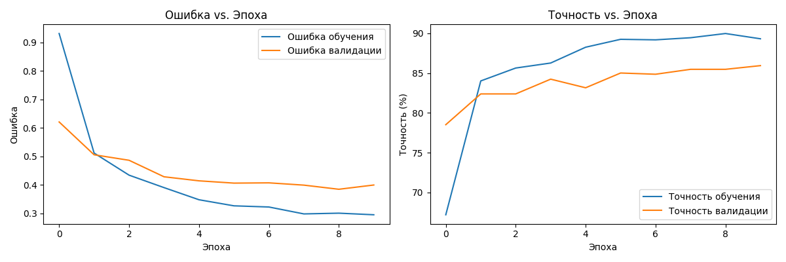
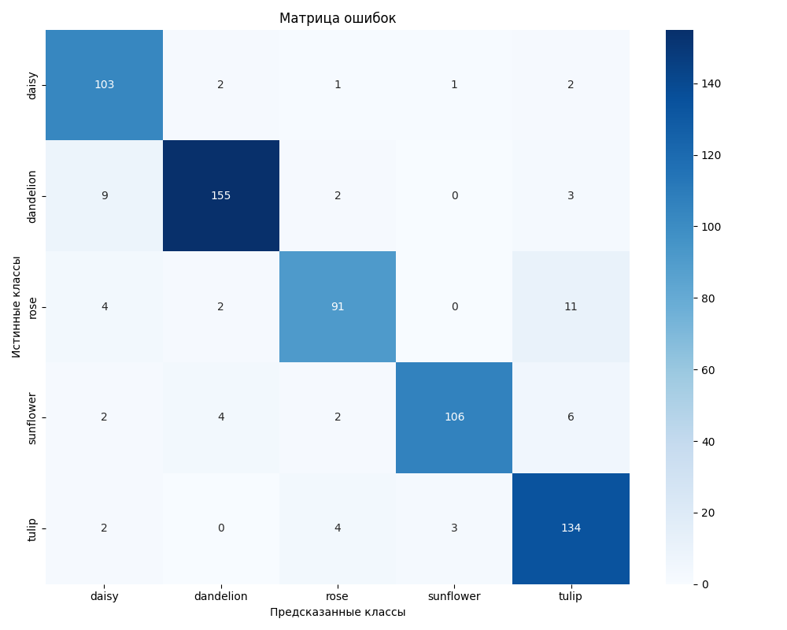

# Классификация цветов с использованием CNN

## 1. Теоретическая база

Сверточные нейронные сети (CNN) - это тип глубоких нейронных сетей, специально разработанный для обработки данных с сеточной топологией, таких как изображения. Основные компоненты CNN включают:

- Сверточные слои (Convolution layers)
- Слои подвыборки (Pooling layers)
- Полносвязные слои (Fully connected layers)

В данном проекте используется архитектура ResNet-18 с предварительным обучением на ImageNet, которая затем дообучается на нашем датасете цветов.

## 2. Описание разработанной системы

### Архитектура системы
- Базовая модель: ResNet-18 (предобученная на ImageNet)
- Функция потерь: CrossEntropyLoss
- Оптимизатор: Adam
- Метрика качества: Accuracy

### Системные требования
- Python 3.8+
- PyTorch 2.0+
- CUDA (опционально, для обучения на GPU)
- 8GB RAM минимум
- Аккаунт Kaggle и API token

### Настройка Kaggle API
1. Зарегистрируйтесь на [Kaggle](https://www.kaggle.com)
2. Перейдите в настройки аккаунта: https://www.kaggle.com/settings
3. Прокрутите до секции "API" и нажмите "Create New API Token"
4. Скачанный файл `kaggle.json` поместите в директорию:
   - Windows: `%USERPROFILE%\.kaggle\kaggle.json`
   - Linux/Mac: `~/.kaggle/kaggle.json`

### Датасет
Используется [датасет цветов с Kaggle](https://www.kaggle.com/datasets/alxmamaev/flowers-recognition), содержащий 5 классов цветов:
- Ромашки
- Одуванчики
- Розы
- Подсолнухи
- Тюльпаны

## 3. Результаты работы

В ходе обучения модели были получены следующие результаты:

1. Точность классификации (accuracy) на тестовом наборе данных составила 90.76%

2. Метрики по классам:
   - Ромашка (daisy): точность - 85.83%, полнота - 94.50%, F1-мера - 89.96%
   - Одуванчик (dandelion): точность - 95.09%, полнота - 91.72%, F1-мера - 93.37%
   - Роза (rose): точность - 91.00%, полнота - 84.26%, F1-мера - 87.50%
   - Подсолнух (sunflower): точность - 96.36%, полнота - 88.33%, F1-мера - 92.17%
   - Тюльпан (tulip): точность - 85.90%, полнота - 93.71%, F1-мера - 89.63%

Графики процесса обучения и матрица ошибок представлены в файлах:
- `results/training_curves.png` - кривые обучения (loss и accuracy)
  
- `results/confusion_matrix.png` - матрица ошибок
  

## 4. Выводы

1. Модель показала высокую общую точность классификации - более 90%, что является хорошим результатом для задачи классификации цветов.

2. Наилучшие результаты модель показала при распознавании подсолнухов (precision 96.36%) и одуванчиков (precision 95.09%).

3. Относительно более низкие показатели точности наблюдаются для ромашек (85.83%) и тюльпанов (85.90%), что может быть связано с их визуальным сходством с другими классами.

4. Высокие значения полноты (recall) для ромашек (94.50%) и тюльпанов (93.71%) говорят о том, что модель редко пропускает эти классы, хотя иногда может их путать с другими.

5. Сбалансированные значения F1-меры (от 87.50% до 93.37%) для всех классов указывают на хорошую общую производительность модели без существенных перекосов в сторону какого-либо класса.

## 5. Использованные источники

1. He, K., Zhang, X., Ren, S., & Sun, J. (2016). Deep residual learning for image recognition. CVPR
2. PyTorch documentation: https://pytorch.org/docs/stable/index.html
3. Kaggle Flowers Dataset: https://www.kaggle.com/alxmamaev/flowers-recognition
